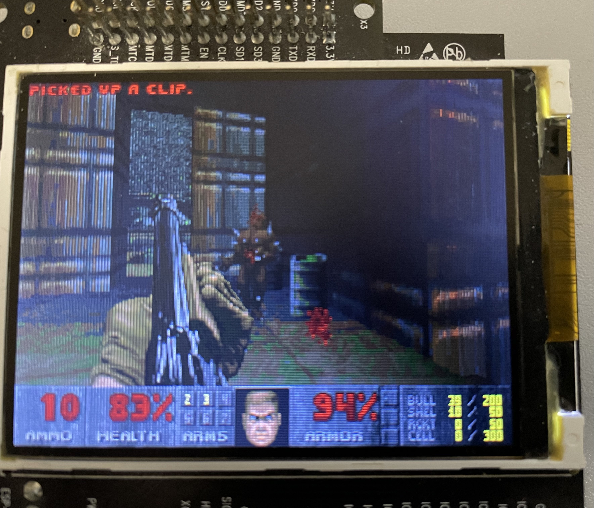

# ESP_DOOM
 

A [doomgeneric](https://github.com/ozkl/doomgeneric) port for ESP32.

The code is made specifically for ESP-WROVER-KIT

# Using the port

To compile and flash you need to:
<ol>
  <li>Download and install ESP-IDF and configure it with Eclipse</li>
  <li>Inside eclipse, open this folder as an existing project</li>
  <li>Set up OpenOCD</li>
  <li>Flash the code to the board</li>
  <li>Edit flashwad.bat and set it to the com port of the FTDI interface 1 on the board and run it</li>
</ol>

# Limitations

First is that no controller support has been implemented. If you want to do it yourself, you can modify the DG_GetKey function inside components/DOOM/platform/doomgeneric_esp32.c

Second is that the same iwad is used as in the [(un)official espressif esp32 doom port](https://github.com/espressif/esp32-doom) which is pretty limited in it's features and it may crash if you play it on some levels. For this reason, the engine is limited to display only the first demo
